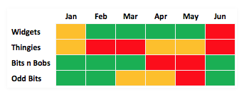
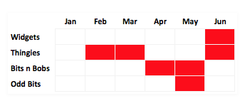

# Sample dashboard colors

↑
↓
→
←

This is bad
This need attention
This is good

This is just info
This is just info
This is just info
This is just info

Column A | Column B | Column C
---------|----------|---------
 A1 | B1 | C1
 A2 | B2 | C2
 A3 | B3 | C3

Do not use too many colors:
- bad

- good

- Investigate trend lines
- % Change (up /down)
- See https://www.klipfolio.com/blog/business-dashboard-design-data-visualization
